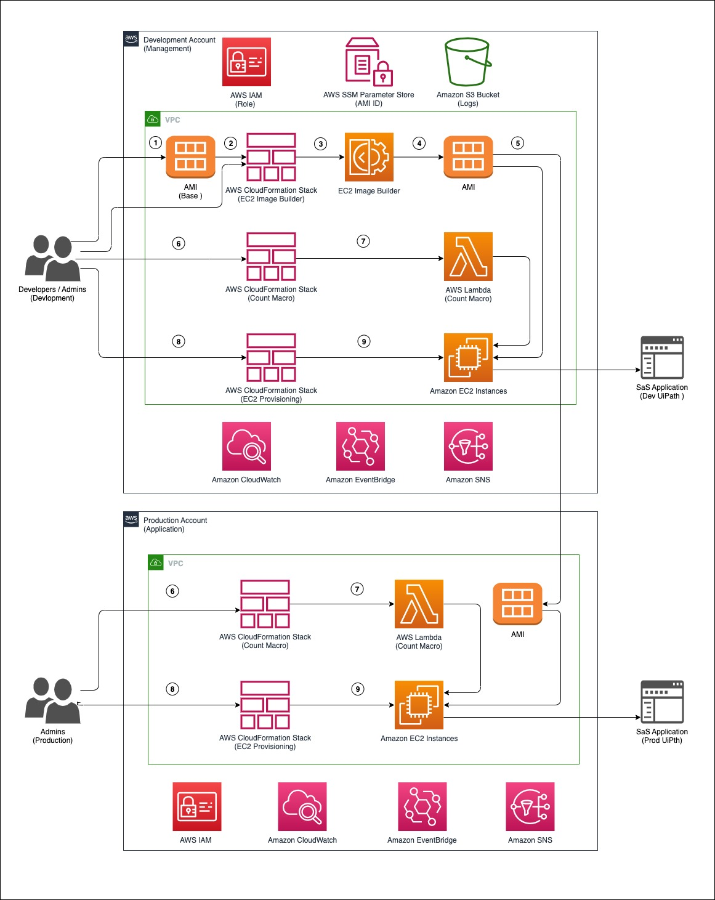

# Set up UiPath RPA bots on Amazon EC2 by using AWS CloudFormation

This solution explains how you can deploy robotic process automation (RPA) bots on [Amazon Elastic Compute Cloud](https://aws.amazon.com/pm/ec2/?trk=32f4fbd0-ffda-4695-a60c-8857fab7d0dd&sc_channel=ps&ef_id=CjwKCAjwgqejBhBAEiwAuWHioN0OQUGUkK4mFr8XbXgLXsXTL6znKF2E3A51kYHzpibijLi0CP3oTRoCV9UQAvD_BwE:G:s&s_kwcid=AL!4422!3!476942909971!e!!g!!amazon%20ec2!11539707735!118057053088_) (Amazon EC2) instances. It uses an [EC2 Image Builder](https://docs.aws.amazon.com/imagebuilder/latest/userguide/what-is-image-builder.html) pipeline to create a custom [Amazon Machine Image](https://docs.aws.amazon.com/AWSEC2/latest/UserGuide/AMIs.html) (AMI). An AMI is a preconfigured virtual machine (VM) image that contains the operating system (OS) and preinstalled software to deploy EC2 instances. This pattern uses [AWS CloudFormation](https://aws.amazon.com/cloudformation/) templates to install UiPath Studio Community edition on the custom AMI. UiPath is an RPA tool that helps you set up robots to automate your tasks.

As part of this solution, EC2 Windows instances are launched by using the base AMI, and the UiPath Studio application is installed on the instances. The pattern uses the Microsoft System Preparation (Sysprep) tool to duplicate the customized Windows installation. After that, it removes the host information and creates a final AMI from the instance. You can then launch the instances on demand by using the final AMI with your own naming conventions and monitoring setup.

## Target Architecture



## Deployment Steps

Check out this APG Pattern for detailed deployment instructions: [Set up UiPath RPA bots automatically on Amazon EC2 by using AWS CloudFormation](https://docs.aws.amazon.com/prescriptive-guidance/latest/patterns/set-up-uipath-rpa-bots-automatically-on-amazon-ec2-by-using-aws-cloudformation.html) 

**Download UiPath file and upload in S3 bucket**
- Download UiPath msi file from the [location](https://download.uipath.com/UiPathStudioCommunity.msi)
- Upload the UiPath msi file into Amazon S3 bucket as per the [documentation](https://docs.aws.amazon.com/AmazonS3/latest/userguide/upload-objects.html)
- Update the bucket name and file key in cloudformation template ec2-image-builder.yaml in the user data [line number 310](https://github.com/aws-samples/uipath-rpa-setup-ec2-windows-ami-cloudformation/blob/main/ec2-image-builder.yml#L310).

**Deploy EC2 Image Builder Pipeline**
- Clone / download, EC2 image pipeline CloudFormation template from this [repository](https://github.com/aws-samples/uipath-rpa-setup-ec2-windows-ami-cloudformation/blob/main/ec2-image-builder.yml)
- Login to [AWS Console](https://aws.amazon.com/console/)
- Navigate to [CloudFormation console](https://aws.amazon.com/console/).
- Create stack as per this [documentation](https://docs.aws.amazon.com/AWSCloudFormation/latest/UserGuide/cfn-console-create-stack.html) .
- Monitor stack events

**Deploy CloudFormation Macros**
- Clone or download the [repository](https://github.com/aws-cloudformation/aws-cloudformation-macros).
- Navigate to Count folder.
- You will need a S3 bucket to store the CloudFormation artifacts:
- If you don't have one already, create one with `aws s3 mb s3://<bucket name>`
- Package the Macro CloudFormation template. The provided template uses the AWS Serverless Application Model so must be transformed before you can deploy it.

```
    aws cloudformation package \
    --template-file template.yaml \
    --s3-bucket <your bucket name here> \
    --output-template-file packaged.yaml
```

For example: 
    `aws cloudformation package --template-file template.yaml --s3-bucket count-macro-ec2 --output-template-file packaged.yaml`
 Deploy the packaged CloudFormation template to a CloudFormation stack:

```
    aws cloudformation deploy \
    --stack-name Count-macro \
    --template-file packaged.yaml \
    --capabilities CAPABILITY_IAM
```

To test out the macro's capabilities, try launching the provided example template:

```
    aws cloudformation deploy \
    --stack-name Count-test \
    --template-file test.yaml \
    --capabilities CAPABILITY_IAM
```
**Deploy EC2 Provisioning CloudFormation**

- Clone / download, EC2 Provisioning CloudFormation template (ec2-provisioning.yaml) from this [repository](https://github.com/aws-samples/uipath-rpa-setup-ec2-windows-ami-cloudformation/blob/main/ec2-provisioning.yaml)
- Login to AWS Console
- Navigate to CloudFormation console.
- Create stack as per this [documentation](https://docs.aws.amazon.com/AWSCloudFormation/latest/UserGuide/cfn-console-create-stack.html)
- Monitor stack events.

